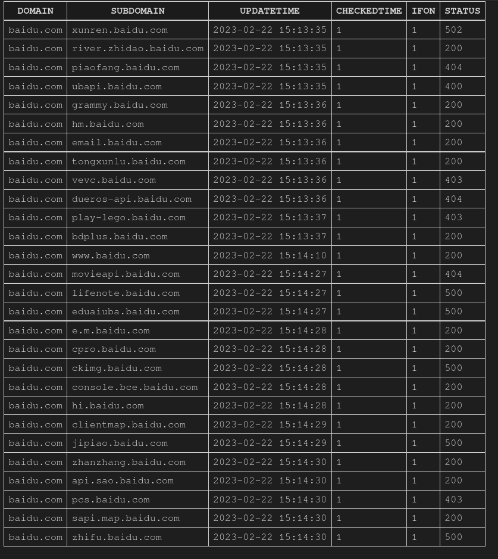
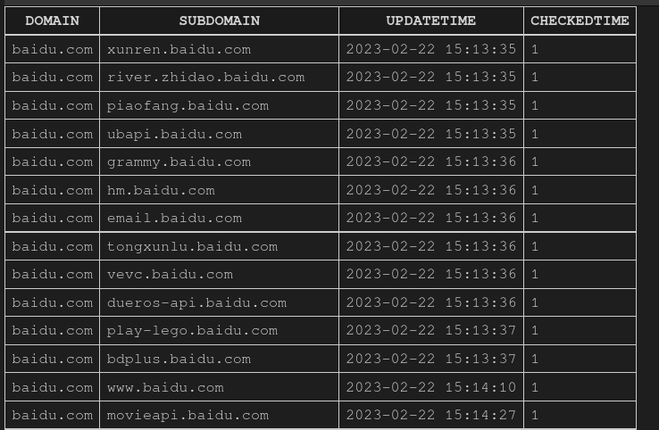

# SubNya_monitor

~~先开个坑，防止自己拖延症犯了~~

一款新的子域名监控, 预计有以下特性：

- 提供接口和不同即时通讯的demo，用于在子域名发现后提醒

- 设置计划任务定期查询新子域名

- 支持定期监控文件夹和命令行读取

- 有新子域名新增会传送到消息队列，可以自定义需要通知的应用程序。

- 内置子域名搜集/扩展，使用subfinder进行查询子域名

## 设计思路图

设计流程图如下

## 数据库设计

### redis数据库

redis数据库负责记录文件md5的变动。保持及时监控文件md5变动，并及时将变动存储在redis数据库中。

### sqlite数据库

sqlite数据库有三张表：

- domains : 记录实时监控的域名下方的子域名

- added_domains： 负责记录本次新增的子域名

- deleted_domains： 负责记录本次删除的子域名

domains结构一览：

（如果status是 `-1` 则代表尚未进行请求获取相应状态）

added_domains结构一览（deleted_domain与其结构一致）：

