# SubNya_monitor

~~先开个坑，防止自己拖延症犯了~~

一款新的子域名监控, 预计有以下特性：
- 提供接口和不同即时通讯的demo，用于在子域名发现后提醒

- 设置计划任务定期查询新子域名

- 支持定期监控文件夹和命令行读取

- 有新子域名新增会传送到消息队列，可以自定义需要通知的应用程序。

- 内置子域名搜集/扩展，使用已有工具 （内置的子域名收集先待定 打算以DNS解析方式来）   

设计流程图如下

