# SubNya_monitor


## 介绍

一款新的子域名遍历监控工具，用于监控目标的子域名情况，包括是否新增和减少。使用 goroutine增加了其遍历速度。并且分别采用redis和sqlite进行存储，利用了redis的快捷性，用其监控文件md5的变化，而sqlite则利用其特性用于保存和更新子域名数据，包括使用事务。最终，输出结果会保留到本地文件记录（可选）或通过接口提醒到个人telegram/email。


当前项目已完成基本功能，其余功能与Dockerfile正在开发中（可见下方todo）。以下是原本计划中要实现的：

- 提供接口和不同即时通讯的demo，用于在子域名发现后提醒

- 设置计划任务定期查询新子域名

- 支持定期监控文件夹和命令行读取

- 有新子域名新增会传送到消息队列，可以自定义需要通知的应用程序。

- 内置子域名搜集/扩展，使用subfinder进行查询子域名


## 配置文件介绍

配置文件位于 `./config/config.yml` 内,参考如下

```yml
schedule:
  - cron: "* * * *"   # 计划用于Dockerfile部署时用

monitor:
  dir: 
    - "./test"  # 要监控的文件夹 ： 会遍历该文件夹下内的全部文件
  settings:
    - timeout : 30   # 间隔时间
    - threads : 10    # 线程数量
    - maxenumerationtime: 10   # 最大枚举时间
    - outfile : "/var/tmp/"    # 输出文件夹
  
  
redis:
  addr: "172.17.0.1:6379"   # redis 链接地址
  password: ""   # redis 密码
  db:   0 

sqlite:
  db_1: "./db/monitor.db"   # 设置数据库保存位置
```


## 使用

```
Options:
  --update, -u           Check update in monitor
  --run, -r              start subdomain finder and update data(include response status code) in sqlite
  --output OUTPUT
  --help, -h             display this help and exit
```

解释：

- `-u` : 用于检查监控文件是否有更新，有则读取其下新增的监控对象

- `-r` ： 对已有的监控对象进行子域名的遍历，并且进行验活（status code）

- `--output` : 设置是否需要输出，默认输出到settings内的设置，否则输出到参数所指的路径。 （待实现）


## TODO：

1. 输出遍历结果功能实现，以及输出格式确认

2. ~~优化错误处理，新增log记录错误~~

3. 设计提醒功能，确保新增子域名能够提醒到用户

4. ~~美化Console输出~~

5. 设置计划任务以及对应计划任务的config文件读取

6. 线程优化，是否使用代理，其他细节etc...

7. ~~英文Readme文档~~


## 设计思路图

最初的设计流程图如下（现在有些变动）



## 数据库设计

### redis数据库

redis数据库负责记录文件md5的变动。保持及时监控文件md5变动，并及时将变动存储在redis数据库中。

### sqlite数据库

sqlite数据库有三张表：

- domains : 记录实时监控的域名下方的子域名

- added_domains： 负责记录本次新增的子域名

- deleted_domains： 负责记录本次删除的子域名

domains结构一览：

（如果status是 `-1` 则代表尚未进行请求获取相应状态）


added_domains结构一览（deleted_domain与其结构一致）：


## 免责声明

该项目用于个人学习go语言使用，用于强化对go的基础知识的认识和了解，从而提升使用go开发工具的能力。请使用该工具的人遵守当地法律，如果有不遵守当地法律而导致的违法事件与开发者无关
